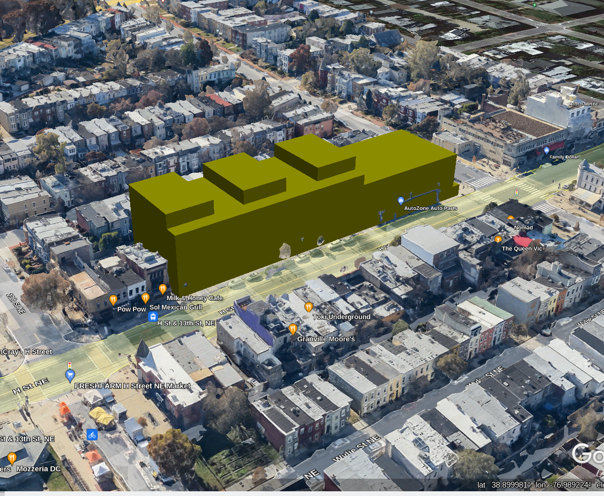
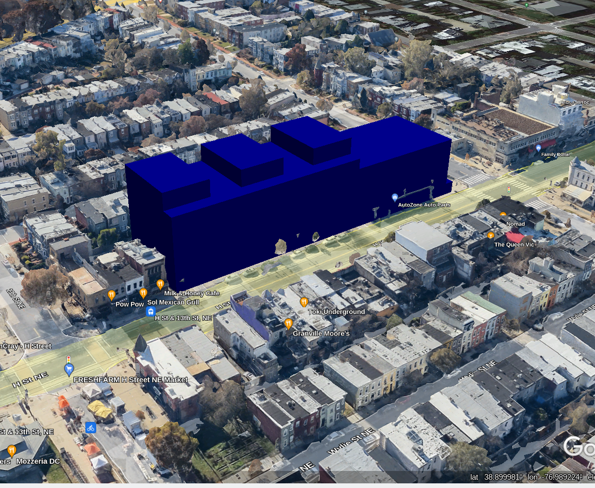
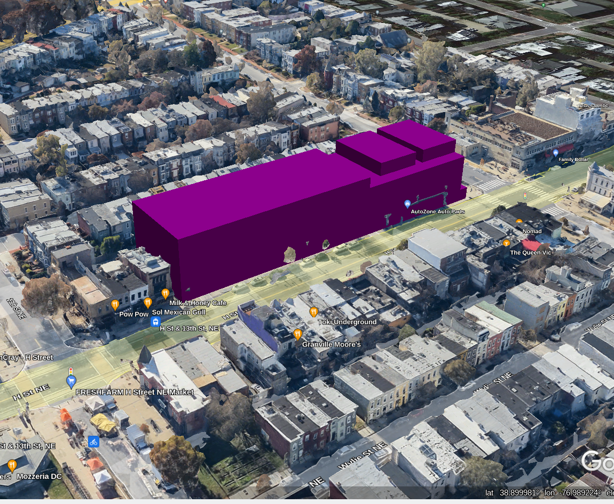
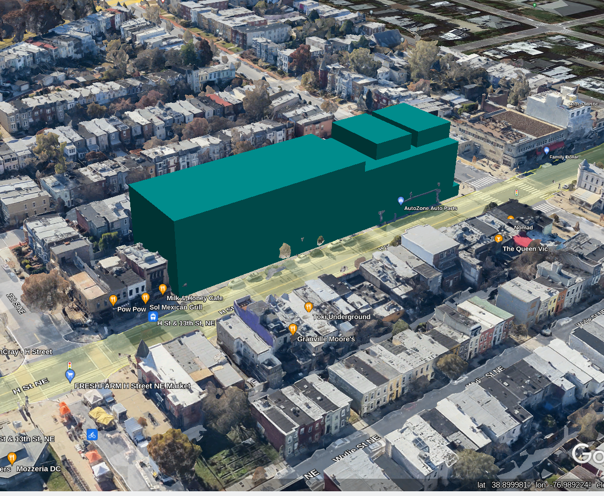
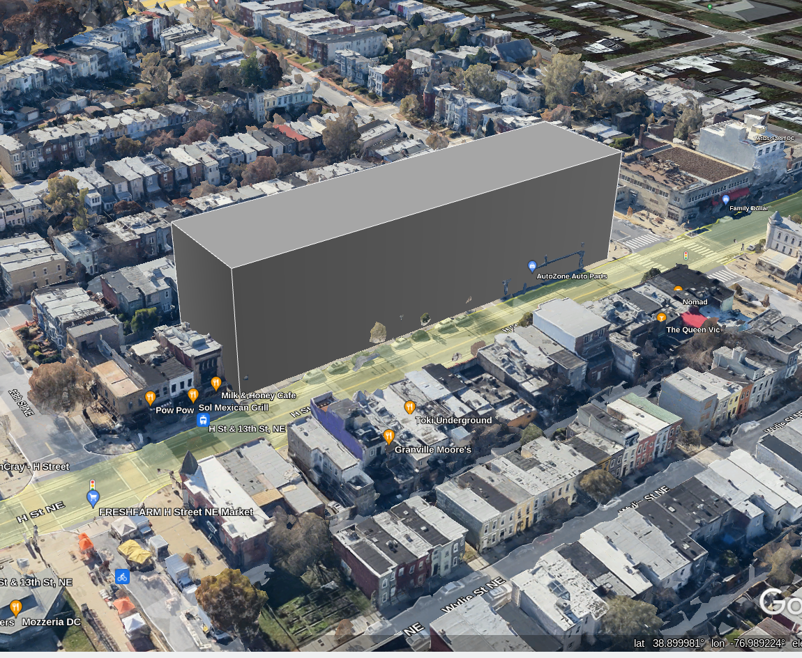

# Rezoning 1207 H ST NE from NC-14 to NC-15
NC-14 to NC-15 models for rezoning of 1207 H ST NE.  Hopefully this repository can be helpful in the future for other DC residents wondering what a zoning change might look like in their neighborhood.


## Process Summary (as I understand it)
1. Developer requests a Future Land Use Map amendment change for 1207 H Street.  FLUM changes are commonly made by DCOZ, ANCs, Ward leadership and other interested parties.
2. ANC 6A Economic Development and Zoning Committee (EDZ) has a hearing on the FLUM amendment and approves it
3. Developer requests the rezoning based on it being "not inconsistent" with FLUM change that has been approved
4. EDZ has a hearing and recommends the rezoning
5. Zoning map updated with a "Pending" zoning
6. Rezoning goes to the full ANC for a hearing
7. Request approved or denied at this point

## Summary of zoning changes
The rezoning based on the map amendment would trigger IZ+ zoning so we'll use Inclusionary Zoning numbers for comparison.

|                        | NC-14 (current) | NC-15 (proposed) |
| ---------------------- | --------------- | ---------------- |
| Floor Area Ratio (FAR) | 3.0             | 4.8              |
| Base height            | 50 feet         | 65 feet          |
| Overlay bonus          | 5 feet          | 5 feet           | 
| Penthouse (1 story)    | 12 feet         | 12 feet          |
| Mechanical (+1 story)  | 15 feet         | 18.5 feet        |
| Total Height           | 82 feet         | 100.5 feet       |

## Folder structure
Each folder represents an example of a potential building under the proposed zoning

Includes COLLADA files for the models used, KML files referencing the models and the packaged KMZ file.
### 1207_H_NE_NC-14 (Current)
Assumes mechanical structures can go on top of the penthouse



### 1207_H_NE_NC-15 (Proposed)
Assumes mechanical structures can go on top of the penthouse


### 1207_H_NE_NC-14_low (Current)
Assumes mechanical structures cannot go on top of the penthouse



### 1207_H_NE_NC-15_low (Proposed)
Assumes mechanical structures cannot go on top of the penthouse



### 1207_H_NE_NC-15_block (Proposed)
This one is an outlier.  It represents the full allowed height of the zone (98 feet I think) as a polygon for use when you can only use a KML file and not a KMZ file, for example in the web based Google Earth.



## Developer Quickstart
### Visualizations
DCOZ has a [really neat 3D mapping tool](https://maps.dcoz.dc.gov/3D/) where you can upload KMZ files.  Sometimes it works, sometimes it doesn't.  Keep retrying; it should work eventually.

Alternatively, you can open the KMZ files in Google Earth Pro.

To use the [web based Google Earth](https://earth.google.com), you can [use the KML file in 1207_H_NE_NC-15_block](1207_H_NE_NC-15_block/doc.kml)
1. In the left sidebar click `Projects`
2. Click `New Project`
3. Choose `Import KML file from computer`
4. Choose `1207_H_NE_NC-15_block/doc.kml`
5. You should get flown to a representation of the NC-15 zoning for 1207 H ST NE

### Repackage KMZ
The models ( the *.blend files ) were created in [Blender](https://www.blender.org/) . Export as COLLADA when you want to repackage.

Go to a command prompt and then
```sh
cd 1207_H_NE_NC-15
zip 1207_H_NE_NC-15.kmz doc.kml files/*
```

Your kmz file should be updated and ready to visualize

## References
### Zoning
* NC-14 - https://handbook.dcoz.dc.gov/zones/neighborhood-mixed-use/nc-14/
* NC-15 - https://handbook.dcoz.dc.gov/zones/neighborhood-mixed-use/nc-15/
* Overlay Summary - https://dcoz.dc.gov/resources/overlaysummary
* Inclusionary Zoning - https://planning.dc.gov/inclusionaryzoning
* Official Zoning Map - https://maps.dcoz.dc.gov/zr16/#l=18&x=-8570790.392460197&y=4707305.073154372&mms=24!21!22!4!2!1!8!11
* DC Regulations for H Street - https://dcregs.dc.gov/Common/DCMR/RuleList.aspx?ChapterNum=11-H9
* Summary of Zone Districts - https://dcoz.dc.gov/page/summary-zone-districts
* Future Land Use Map (FLUM) - https://plandc.dc.gov/page/future-land-use-map-and-generalized-policy-map
* Capitol Hill Area Element - https://planning.dc.gov/sites/default/files/dc/sites/op/publication/attachments/15_CH.pdf
* Owner Lot line dimensions - https://opendata.dc.gov/datasets/owner-lot-line-dimensions/explore?location=38.899905%2C-76.989483%2C19.93

### Development tools and references
* Blender - https://www.blender.org/
* KML Tutorial - https://developers.google.com/kml/documentation/kml_tut
* KML Reference - https://developers.google.com/kml/documentation/kmlreference
* KML Examples - https://developers.google.com/kml/documentation/KML_Samples.kml
* DC Open Data 3D Building data - https://opendata.dc.gov/search?q=3d%20buildings
* Convert ArcGIS ESRI data - http://bbonczak.com/posts/multipatch-conversion/

## Acknowledgements
__N.B.__ Any errors or misconceptions in this project are my own. If you spot any mistakes, or can otherwise improve the project, please open a pull request.

Members of the [ANC 6A Economic Development and Zoning Committee](https://anc6a.org/committees/) were invaluable in helping me understand the zoning process a little better. I greatly appreciate the time they spent going back and forth over email with me to help me understand the zoning rules and regulations, the process from FLUM to construction, and the complexities of local government. They have my thanks!

Additionally, representatives of the DCOZ promptly addressed my questions about the 3D zoning map and where to find the data the map uses. I hope to work with them to make the 3D Zoning Map even better. They, and [Open Data  DC](https://opendata.dc.gov/) have my thanks too!

## TODO
- Update KML files to use the same LookAt.  
- Update images to use the same perspective based on the LookAt
- Make file naming consistent
